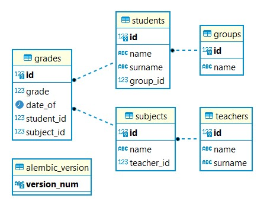

# GoIT_WEB_HW_7
Individual homework №7 at GoIT school: SQLAlchemy, alembic migrations


## Description

This project shows how to work with `PostgreSQL` database and ORM `SQLAlchemy`. First, the project connects to PostgreSQL database, the database itself can be launched, for example, in `Docker` container. After connecting to the database, models are created, these are the future tables in the database. Then we can fill the database with fake or real data. Once the database is populated and we have an ER-diagram, we can run queries on the database. Some database queries are described in `my_select.py`, but you can also use `CRUD` to work with the database.

## Running the program

To start working with this project you need to have access to `PostreSQL` database. For example, you can host PostreSQL using `Docker`. To do this, start Docker on your machine, download the official `PostreSQL image` and start the container with the command in command line
```
docker run --name some-postgres -p 5432:5432 -e POSTGRES_PASSWORD=mysecretpassword -d postgres.
```
Instead of `some-postgres`, choose your own container name, and instead of `mysecretpassword`, choose your own password for connecting to the database. After that, set your password in the `config.ini` file: `PASSWORD=mysecretpassword`.

• Clone this repository to your PC. To do this, run the command line and type
```
git clone https://github.com/S-Stepanov-1/GoIT_WEB_HW_6.git
```
• After that you need to install the dependencies. Use command
```
poetry install
```
• Then you need to create `alembic` migrations:
```
alembic revision --autogenerate -m 'Init'
```
After this command you will have the empty tables in your DB PostgreSQL.
####  You will have the following Entity-Relationship model


• Now you can fill the database with fake random data. Use this command:
```
py seed.py
```
Now your tables are filled with data.

• To query the database you have to run the `my_select.py` file and follow the instructions to enter the number of the query you want to perform. 
```
py my_select.py
```


## Using CRUD

To use the CRUD operations (create, read, update and delete) you should run the `cli_crud.py` file and pass one of the commands at startup, as well as additional parameters for each of the CRUD operations. Examples of program startup calls are given below.

• Create a new Teacher:
```
--action create -m Teacher --name 'Boris Jonson'
```
• Show all Teachers
```
--action read -m Teacher
```
• Update a Teacher's data wit id=3
```
--action update -m Teacher --id 3 --name 'Andry Bezos'
```
• Delete a Teacher with id=3
```
--action delete -m Teacher --id 3
```
